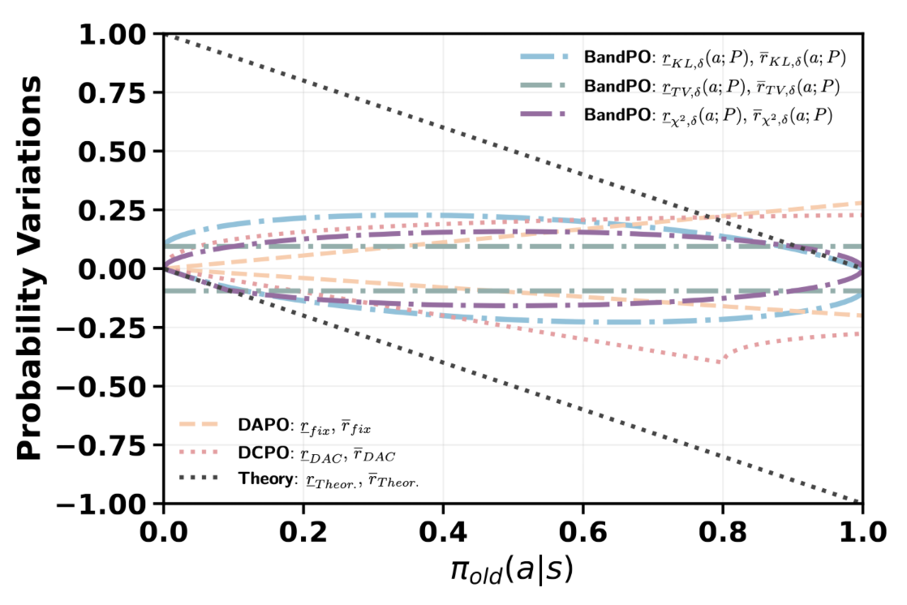
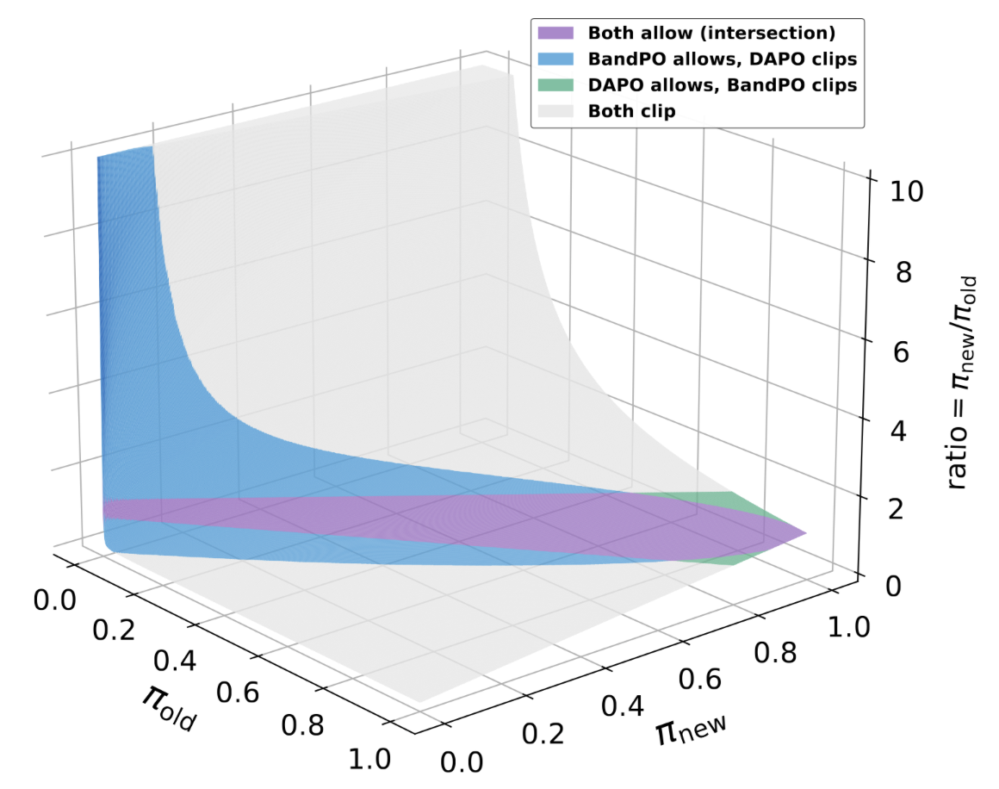

# BandPO: Bridging Trust Regions and Ratio Clipping via Probability-Aware Bounds for LLM Reinforcement Learning

[](#) [](https://www.gnu.org/licenses/gpl-3.0)

This is the official repository for **BandPO**, a novel reinforcement learning algorithm designed to resolve the fundamental exploration bottlenecks in Large Language Model (LLM) post-training. 

## 🚨 The Bottleneck in Canonical Clipping

Proximal constraints are fundamental to the stability of LLM reinforcement learning. The canonical clipping mechanism (widely used in PPO and DeepSeek's GRPO) serves as an efficient surrogate for trust regions by confining the probability ratio within fixed bounds:

$$1 - \epsilon_{-} \leq \frac{\pi_{\theta}(a \mid s)}{\pi_{\text{old}}(a \mid s)} \leq 1 + \epsilon_{+}$$

While this ensures stability, **fixed clipping bounds strictly constrain the upward update margin of low-probability actions**, disproportionately suppressing high-advantage tail strategies. 

Mathematically, the feasible probability variation $\Delta \pi(a|s)$ scales linearly with the old probability:

$$-\epsilon_- \pi_{\text{old}}(a|s) \le \Delta \pi(a|s) \le \epsilon_+ \pi_{\text{old}}(a|s)$$

**Why is this a problem for LLMs?**
In LLM RL, long reasoning horizons and extensive group sampling result in a high incidence of low-probability actions. Consider a "tail" token with an initial probability of **0.08**. Under a standard upper bound of $\epsilon_+ = 0.2$, the maximum permitted probability increase is a negligible **0.016**, even if this token leads to a highly superior reasoning path. 

This structural bottleneck nullifies the gradient contributions of low-probability, positive-advantage actions, inducing rapid entropy collapse and inhibiting effective exploration.

<p align="center">
  
</p>

> **Figure 1: Bounds of Probability Variation.** Comparison of clipping bounds. Unlike fixed bounding strategies (like DAPO and DCPO) that either fail to provide meaningful exploration margins for tail tokens or violate physical simplex constraints for head tokens, BandPO strictly adheres to simplex constraints while unlocking significant upward variation for low-probability actions.

## 💡 What is BandPO?

To address the fundamental tension between optimization constraints and effective exploration, we introduce **Band-constrained Policy Optimization (BandPO)**. 

Instead of relying on rigid, static clipping thresholds, BandPO replaces canonical clipping with **Band**, a unified theoretical operator. This operator elegantly projects trust regions defined by general $f$-divergences (such as KL, Total Variation, or Pearson $\chi^2$) into **dynamic, probability-aware clipping intervals**.

### Key Features:
* **Dynamic Upward Margins:** As shown in the figure below, BandPO adaptively expands the feasible upward margin for low-probability actions (the blue region), preventing premature clipping and preserving critical exploration gradients.
* **Simplified Tuning:** By framing the mapping as a convex optimization problem, BandPO controls the proximal constraints through a single, interpretable radius parameter, significantly streamlining hyperparameter tuning compared to heuristic asymmetric clipping methods.
* **Robust Performance:** BandPO guarantees globally optimal numerical solutions (with closed-form solutions for specific divergences) and consistently outperforms canonical clipping (GRPO) and Clip-Higher baselines across diverse models (e.g., Qwen2.5, Llama3) on mathematical reasoning benchmarks, robustly mitigating entropy collapse.

<p align="center">
  
</p>

> **Figure 2: Ratio Clipping Regions (BandPO vs. DAPO).** Under a KL-induced trust region, BandPO explicitly expands the update margin for low-probability, positive-advantage actions compared to fixed asymmetric bounds.

## 🗂️ Repository Structure

* `init.sh`: A one-click script for initializing environment variables and downloading base models and datasets.
* `data/`: Directory for storing models, datasets, checkpoints, experimental records, and logs. 
  * *Note: Only the directory structure is synced to Git (via `.gitkeep`); large data files are explicitly ignored.*
  * Includes utility scripts for one-click downloading of datasets/base models and syncing them to specified Hugging Face repositories.
  * **Dataset Folders:** Each dataset subfolder contains a `download.py` for local fetching, as well as `<dataset_name>.sh` and `<dataset_name>.py` to preprocess the data into the standard `verl` format.
* 🌟 `RLtraining/`: The core reinforcement learning training implementations for BandPO. **`RLtraining/verl/verl/bandpo/band/`: This directory contains the core operator implementation of the BandPO algorithm proposed in this paper.**
    * **Main Operator:** The main entry point for the Band operator is located at `RLtraining/verl/verl/bandpo/band/band.py`.
    * **Extensibility:** If you wish to implement and experiment with a new $f$-divergence, please refer to the detailed comments and example code provided within the script. The dispatcher design makes it extremely easy to add custom constraints.
    * **Supported Divergences:** We currently provide out-of-the-box implementations for KL, Pearson $\chi^2$, and Total Variation (TV). To use them, simply set the configuration method name to `"bandkl"`, `"bandchi2"`, or `"bandtv"`, respectively.
    * **Legacy Implementation:** The older, non-universal implementation of BandKL is preserved in `RLtraining/verl/verl/bandpo/kl2clipbound` for reference. Empirical tests confirm that the maximum numerical difference between the new universal solver and the legacy method is strictly bounded within $1 \times 10^{-6}$, which is safely negligible.
* `utils/`: Contains the required `apex` repository code for installation, alongside utility templates for data analysis, plotting, Git workflows, and Slurm cluster job scheduling.


## ⚡ Quick Start: Training

To reproduce the main results of BandPO or train on custom datasets, please follow the sequence below after completing the installation.

### 1. Initialization
First, ensure that project paths and environment configurations are correctly linked by running the initialization script:

```bash
# Initialize project environment
python init.py
```

### 2. Launch Distributed Runtime
BandPO leverages **Ray** for high-performance distributed computing. Use the provided utility to start the Ray cluster with optimal resource configurations:

```bash
# Start the Ray runtime
bash utils/ray/initialization.sh
```

### 3. Run Experiments
Navigate to the baseline scripts directory. We provide ready-to-use recipes for both the **GRPO baseline** and **BandPO** (e.g., using Qwen-1.5B-Distill).

```bash
# Navigate to the experiment scripts folder
cd RLtraining/verl/baselinescripts

# -------------------------------------------------------
# Option A: Canonical GRPO (Baseline)
# -------------------------------------------------------
bash DeepSeek-R1-Distill-Qwen-1.5B-L4k/start_grpo_official.sh

# -------------------------------------------------------
# Option B: BandPO (Band-KL Constraint, Radius=0.05)
# -------------------------------------------------------
bash DeepSeek-R1-Distill-Qwen-1.5B-L4k/bandpo__grpo_plus_ray_bandkl005.sh
```

### 📝 Monitoring & Logging
By default, Ray redirects the main process output. To monitor training progress, metrics, and system logs in real-time, please inspect the **Ray driver logs** located at:

`/tmp/ray/session_<SESSION_ID>/logs/job-driver-raysubmit_<SUBMIT_ID>.log`

> **Note:** The specific `<SESSION_ID>` and `<SUBMIT_ID>` are generated dynamically and printed to your terminal immediately after submitting the job.

## 📦 Modular Integration & Extension

We explicitly decoupled the mathematical optimization core from the training loop to support easy integration into other RL frameworks.

> **💡 Developer Highlight: Plug-and-Play the Band Operator**
>
> If you intend to apply **BandPO** to your own codebase or develop custom constraints (e.g., new $f$-divergences), you do **not** need to migrate the entire repository. The Band operator is designed as a standalone module.
>
> **1. Copy the Core Module:**
> Simply transplant the following directory into your project:
> `RLtraining/verl/verl/bandpo/band/`
>
> **2. Customize:**
> The central projection logic and solver are encapsulated entirely within `band.py`. You can directly modify this file to implement new bounds or integrate the solver into standard PPO/GRPO loops.


## 🚀 Installation

Setting up the environment for Large Language Model RL can be daunting, especially on shared clusters without root privileges. We provide a comprehensive, step-by-step guide to installing the required dependencies, including local CUDA/cuDNN configurations for non-root users.

### 1. Clone the Repository
```bash
git clone https://github.com/OpenMOSS/BandPO.git
cd BandPO
```

### 2. System Requirements: CUDA 12.4 Setup (Non-Root Friendly)
Our framework (based on `verl`) requires **CUDA $\ge$ 12.4**. We use CUDA 12.4 as the minimum supported version. If you do not have root privileges (`sudo`), follow these steps to install CUDA locally:

1. **Download:** Go to the [CUDA 12.4 Toolkit Archive](https://developer.nvidia.com/cuda-12-4-0-download-archive) and select the **runfile (local)** installer type for your OS.
   *(Useful commands to check your OS: `cat /etc/os-release`, `uname -m`)*
2. **Install Options:** Run the installer. 
   * ⚠️ **Crucial:** Deselect the "Driver" component during installation to prevent conflicts/errors.
   * Go to "Options" and change the installation path (e.g., to `$HOME/cudas/cuda-12.4`).
   * Uncheck "Create symbolic link from /usr/local/cuda".

**Modify your `.bashrc`:**
```bash
vim ~/.bashrc

# Append the following lines (adjust the path if necessary):
export CUDA_HOME=$HOME/cudas/cuda-12.4
export PATH=$CUDA_HOME/bin:$PATH
export LD_LIBRARY_PATH=$CUDA_HOME/lib64:$LD_LIBRARY_PATH
export LD_LIBRARY_PATH=/lib/x86_64-linux-gnu:/usr/lib/x86_64-linux-gnu:$LD_LIBRARY_PATH
export CUDACXX=$CUDA_HOME/bin/nvcc
```
Verify the installation:
```bash
source ~/.bashrc
which nvcc && nvcc --version
```

### 3. cuDNN Installation (Archive Method)
If you lack root access to use `.deb` packages, install cuDNN via the tar archive. Download the corresponding version from the [cuDNN Archive](https://developer.nvidia.com/cudnn-archive).

```bash
# 1. Extract the downloaded archive
mkdir -p ~/tmp/cudnn && cd ~/tmp/cudnn
tar -xf /path/to/cudnn-linux-*-archive.tar.xz
cd cudnn-linux-*-archive

# 2. Copy files to your local CUDA directory
mkdir -p "$CUDA_HOME/include" "$CUDA_HOME/lib64"
cp include/cudnn*.h "$CUDA_HOME/include/"
cp -P lib/libcudnn* "$CUDA_HOME/lib64/"
chmod a+r "$CUDA_HOME/include/cudnn*.h" "$CUDA_HOME/lib64/libcudnn*"

# 3. Verify installation
grep -HE "CUDNN_(MAJOR|MINOR|PATCHLEVEL)" "$CUDA_HOME/include/cudnn_version.h"
```

### 4. Python Environment & PyTorch
⚠️ **Note:** Ensure you are using `CPython` (not GraalPy). Verify with: `python -c "import sys; print(sys.implementation);"`.

```bash
# Create and activate conda environment
conda create -n bandpo python=3.10
conda activate bandpo

# Install PyTorch (v2.6.0 is the highest available for CUDA 12.4)
pip install torch==2.6.0 torchvision==0.21.0 torchaudio==2.6.0 --index-url https://download.pytorch.org/whl/cu124

# Install base dependencies
pip install "distro<2,>=1.7.0"
pip install -U "pyyaml>=5.1" datasets huggingface-hub
```

### 5. Install NVIDIA Apex
Apex is required for Megatron-LM or FSDP backends. We have already included the `apex` repository inside the `utils` directory. 
```bash
cd utils/apex
MAX_JOB=32 pip install -v --disable-pip-version-check --no-cache-dir --no-build-isolation --config-settings "--build-option=--cpp_ext" --config-settings "--build-option=--cuda_ext" ./
cd ../../
```

### 6. Install Training & Inference Backends (`verl`)
We use a heavily customized version of `verl` located in `RLtraining/verl`. It supports FSDP/Megatron-LM for training, and vLLM/SGLang/TGI for inference.

*(Tip: If the script fails, we recommend running the commands inside the script line-by-line.)*
```bash
cd RLtraining/verl

# For Megatron-LM backend:
bash scripts/install_vllm_sglang_mcore.sh

# OR for FSDP backend only:
USE_MEGATRON=0 bash scripts/install_vllm_sglang_mcore.sh
```
**Important Cleanup:** To prevent Ray cluster initialization errors due to exceeding maximum file size limits, delete the large wheel files generated during installation:
```bash
rm flash_attn-*.whl
rm flashinfer_python-*.whl
```

### 7. Fix Dependency Conflicts
Recommended: We strongly suggest installing the complete dependency list directly to ensure a fully compatible environment:
```bash
# cd /path_to_BandPO
pip install -r requirements.txt
```

Alternative: If you prefer to resolve conflicts manually or encounter specific errors, you can address known version issues for ray, megatron-core, and cudnn individually using the commands below:
Resolve known version conflicts for `opentelemetry`, `megatron-core`, and `cudnn`:
```bash
# Fix Ray and Opentelemetry
pip install "ray[default]==2.49.1"
pip install -U \
  "opentelemetry-api==1.26.0" \
  "opentelemetry-sdk==1.26.0" \
  "opentelemetry-semantic-conventions==0.47b0" \
  "opentelemetry-exporter-otlp==1.26.0" \
  "opentelemetry-exporter-otlp-proto-grpc==1.26.0" \
  "opentelemetry-exporter-otlp-proto-http==1.26.0" \
  "opentelemetry-exporter-prometheus==0.47b0" \
  --upgrade-strategy only-if-needed

# Fix Megatron-Core (0.12.2) missing dependencies
pip install flask-restful nltk tensorstore zarr pytest-cov pytest-mock pytest-random-order nvidia-modelopt

# Fix cuDNN Python bindings
pip install --no-cache-dir "nvidia-cudnn-cu12==9.1.0.70"
```

### 8. Finalize `verl` Installation
```bash
# Ensure you are still in the RLtraining/verl directory
pip install --no-deps -e .
cd ../../
```

## 🛠️ Known Issues

* **Wandb Timeout:** If you encounter timeout errors with Weights & Biases (`wandb`) during training, try enabling a VPN. If the issue persists, please set `WANDB_MODE="offline"` in your `runtime_env.yaml` to log metrics locally.

## 🏔️ Philosophy & Transitioning

If you are like me—transitioning from the realm of CPU-based mathematical optimization to the engineering-heavy world of GPU-based deep learning—you might find the engineering overhead daunting. 

We designed the `utils` folder to help you quickly get up to speed with relevant systems, particularly Slurm-based GPU scheduling. Furthermore, the `init.sh` script in the root directory is built to help you rapidly migrate and deploy code, minimizing your engineering time so you can focus your energy on rigorous theoretical analysis.

> 愿我们都能在 AI 领域中做出自己的贡献，能够受益于后人。虽路途坎坷，但山高万仞，只登一步。
> *(May we all make our contributions to the AI field and benefit future generations. Though the journey is arduous, a mountain of ten thousand fathoms is scaled one step at a time.)*

## 📬 Contact

For any questions, discussions, or collaborations, feel free to reach out:
* **Yuan Li:** [liyuan24@m.fudan.edu.cn](mailto:liyuan24@m.fudan.edu.cn)

## 📝 Citation

If you find BandPO or this repository useful in your research, please consider citing our paper:

```bibtex
@article{li2024bandpo,
  title={BandPO: Bridging Trust Regions and Ratio Clipping via Probability-Aware Bounds for LLM Reinforcement Learning},
  author={Li, Yuan and Wang, Bo and Gao, Yufei and Yao, Yuqian and Wang, Xinyuan and Yin, Zhangyue and Qiu, Xipeng},
  journal={arXiv preprint arXiv:XXXX.XXXXX},
  year={2024}
}